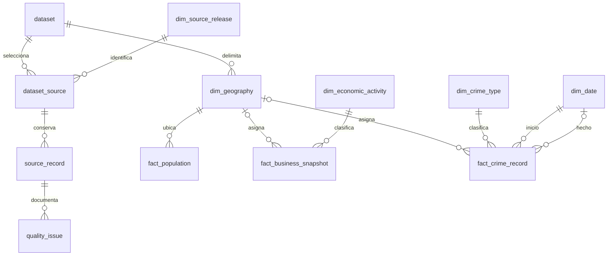

# Fase 2 — Modelo, ETL y vistas analíticas

Estado al 2026-10-03: **implementada y validada localmente; lista para revisión del PR**. No se ha fusionado con main. La validación remota de GitHub Actions y la ejecución en otro equipo no se afirman como realizadas.

## Resultado comprobado

El dataset local 2 contiene 2,431 AGEB, 2,431 hechos censales (9,138,524 habitantes), 474,328 establecimientos y 204,121 filas FGJ. La selección candidate-v1 conserva 199,650 filas FGJ; 191,233 tienen asignación única a una AGEB. Se almacenan también exclusiones y problemas de calidad.

La carga completa fue confirmada después de 18 controles. Una segunda ejecución reconoce el mismo fingerprint y verifica el dataset sin duplicarlo. Las asignaciones de los 474,328 establecimientos y 204,121 registros FGJ coinciden fila por fila con Fase 1; también coincide la elegibilidad de las 204,121 filas. Once controles adicionales verifican las vistas. Las 23 pruebas incluyen nueve de integración en una base *_test separada.

Evidencia: [carga](fase2_carga_inicial.json), [repetición](fase2_idempotencia.json), [paridad](fase2_paridad.json), [indicadores](fase2_indicadores_validacion.json). Son snapshots de ejecución local, no garantías de calidad que excedan las fuentes.

## Modelo y granularidad

| Objeto | Una fila representa / clave |
|---|---|
| dw.dataset | Combinación inmutable de configuración, fuentes, regla y huella del pipeline |
| dw.dim_source_release | Fuente y SHA-256; URL, ruta y edición conservadas |
| dw.dataset_source | Papel de una fuente dentro del dataset |
| staging.source_record | Registro original seleccionado: dataset + fuente + clave técnica; payload JSONB |
| dw.dim_geography | AGEB dentro de un dataset, cartografía versionada, geometría MultiPolygon 4326 y área geodésica |
| dw.dim_date | Día calendario realmente observado en fechas válidas; roles inicio/hecho independientes |
| dw.dim_economic_activity | Código de seis dígitos + versión SCIAN; sector normalizado |
| dw.dim_crime_type | Etiquetas originales de tipo y categoría con origen FGJ |
| dw.fact_population | Una AGEB con geometría por edición censal del dataset |
| dw.fact_business_snapshot | Un ID DENUE por edición del dataset; ubicación y asignación pueden quedar sin AGEB |
| dw.fact_crime_record | Una fila publicada FGJ por descarga y dataset; NO incidente único demostrado |
| meta.quality_issue | Un problema por registro/código de motivo; puede haber varios por fila |
| meta.etl_run | Intento de carga, estado, fingerprint y reporte; errores sin credenciales |

Claves sustitutas en dimensiones; claves de hechos incluyen dataset/fuente/registro. Las FK compuestas impiden enlazar hechos con geografía de otro dataset. La dimensión económica no presenta las descripciones originales como etiquetas canónicas: se guardan en el hecho y en staging. `per_ocu` conserva su estrato, no se convierte en empleos exactos. Las horas originales se preservan en staging; esta interfaz usa fechas a precisión de día.

## Flujo y garantías

1. Verificar SHA-256 de los cuatro originales contra el manifiesto de cierre; no leer salidas de Fase 1 como entradas ETL.
2. Registrar intento; tomar bloqueo transaccional para evitar cargas concurrentes del mismo proyecto.
3. Si existe el fingerprint, ejecutar conciliación y terminar como skipped. Cambios en fuentes, configuración o código del pipeline generan otro dataset; no reemplazan silenciosamente uno anterior. Elegir siempre dataset_id al analizar.
4. Cargar staging con COPY. Censo: 2,433 totales AGEB; cartografía: 2,431 claves con atributos mínimos y geometría en dimensión; DENUE/FGJ: todas las filas. El ZIP/CSV original continúa siendo el archivo autoritativo.
5. Transformar dentro de PostgreSQL. Reservados '*' y vacío -> NULL; tokens censales inesperados provocan error. Coordenadas ausentes, no numéricas, fuera de rango o (0,0) -> punto nulo.
6. Asignar por ST_Intersects contra las AGEB del dataset con índice GiST. Cero coincidencias -> fuera; una -> asignado; varias -> ambiguo sin asignación. No usar vecino más próximo.
7. Aplicar candidate-v1 por prioridad, registrar calidad y reconciliar antes de COMMIT. Un fallo revierte datos del dataset completo; el intento fallido queda registrado aparte.

Se observó realmente una reversión completa en el primer intento, antes de corregir la ejecución de múltiples sentencias parametrizadas: dataset y staging quedaron en cero. Los IDs de secuencia no se reciclan al revertir; por eso el primer dataset confirmado tiene ID 2. En otro equipo puede tener ID 1: no copiar el 2 como constante universal.

El checksum usa bytes de archivos y configuración; diferencias de checkout pueden producir otro fingerprint. Es un identificador de ejecución reproducible con esos insumos, no un identificador global de CDMX. Una terminación brusca del proceso puede dejar un intento marcado running aunque PostgreSQL revierta la transacción: inspeccionar antes de reiniciar; no borrar el historial.

## Migraciones

`python src/database.py` aplica sql/migrations de forma transaccional, registra hashes y rechaza cambios de un archivo ya aplicado. No editar migraciones aplicadas: agregar la siguiente.

`python src/publish_analytics.py` aplica versiones separadas bajo sql/analytics usando el mismo registro de migraciones. Esto permite evolucionar vistas sin forzar otra copia de hechos. Las migraciones del DW y los archivos del pipeline sí participan en la huella de carga.

sql/init sólo inicializa extensiones/esquemas en un volumen vacío. Reiniciar Docker no aplica por sí solo las migraciones de Fase 2. No se ejecutan DROP de tablas persistentes ni TRUNCATE durante el ETL.

## Interfaz de indicadores

| Vista | Uso |
|---|---|
| analytics.kpi_ageb | Población/densidad, PEA, negocios/densidad/por población, densidades minorista/servicios, sectores dominantes, seguridad total/por población/por negocios |
| analytics.age_distribution | Ocho grupos etarios, proporciones y estado de faltantes; KPI de edades |
| analytics.crime_by_type_month | Registros por tipo y mes de inicio; KPI temporal |
| analytics.population_by_ageb | Insumos censales y edad derivada 25–59 |
| analytics.business_by_ageb | Conteos sectoriales y empates de dominancia |
| analytics.crime_by_ageb | Seleccionados, competencia desconocida y excluidos asignados |

Las vistas agregan cada hecho por separado antes del join. Tasas con denominador cero/desconocido -> NULL; la salida incluye estados de denominador. Los 77 empates se representan como arreglo de sectores, y las 12 AGEB sin negocios tienen dominancia NULL. Las sumas de edades pueden no cerrar por faltantes/edad no especificada. La vista tipo/mes es dispersa: sólo grupos observados, no una promesa de reporte completo.

Las restricciones del cierre de Fase 1 siguen vigentes: universo urbano parcial, dos claves excluidas, cohorte de inicio 2020, precisión de coordenadas desconocida y sensibilidad local. Estas vistas implementan el contrato del proyecto; no certifican riesgo delictivo, causalidad ni equivalencia con SESNSP.

## Reproducir

Ver [HANDOFF_FASE3.md](../HANDOFF_FASE3.md) para secuencia completa desde un clon, selección de dataset y ejemplo de consumo. No publicar .env ni originales. El exportador usa una transacción de sólo lectura y snapshot consistente, y sólo consulta dw/analytics.

## Pendientes de revisión y siguiente etapa

- Usuario crea PR desde la rama codex/fase-2-modelo-etl-postgis hacia main; revisar y fusionar después.
- Verificar GitHub Actions cuando termine y ejecutar la guía en otro equipo. Workflow preparado, resultado remoto no observado.
- Análisis exploratorio/correlaciones, construcción y justificación de pesos espaciales, Moran/LISA/bivariado, sensibilidad sobre indicadores finales y reporte.
- Revisar capacidad/tiempos si se incorporan otras ediciones; cargador y conciliación actuales son explícitamente CDMX 2020, no un ETL genérico para cualquier ciudad.
- La cuenta local de desarrollo tiene privilegios de creación de esquema. Si se comparte una instancia, crear acceso de lectura específico antes de dar credenciales a terceros.
